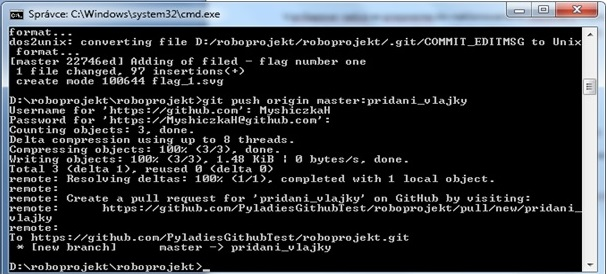

Title: Čtvrtý sraz - GitHub
Date: 2018-11-03 18:05:00
Modified: 2018-11-06 18:05:00
Author: Hanka Střondalová

A jsme zpět. Co dnes? užitečný a u začátečníků respekt vzbuzující ... GIT... Abychom mohly naplno rozjet náš projekt, potřebujeme si naše kódy sdílet jako opravdové programátorky.
Tentokráte se hodiny ujal Jirka a začal to jak se patří a to malým opáčkem. V rychlosti jsme si s ním projely informace, které jsme už dříve obdržely jako účastnice základního kurzu, ale co si budeme povídat - připomenutí se hodí vždy: git init, git status, git add, git commit, pozor změna - git diff, užitečný git log, grafický pomocníček gitk. To hlavní, k čemu jsme dnes směřovaly, je spolupráce na GitHub.
Jirka nám vysvětloval pomalu a jistě (to abychom mu hned na začátku asi neutekly - nebo po něm něco rovnou nehodily :-)), že hlavními výhodami pro nás na GitHubu bude mergovaní našich výtvorů a nápadů. Každou větev (branch), kterou si uděláme a která bude obsahovat naše změny a nápady, prostřednictvím GitHubu někdo další zkontroluje a spojí, takže výsledek budeme mít každá k dispozici z pohodlí svého gauče.
Něco málo o GitHubu:
Samotný repozitář nemáme pouze na svém počítači a tudíž je pravděpodobnost, že o něj s odchodem našich notebooků do křemíkového nebe, nepřijdeme.
GitHub je možno využívat zdarma a samozřejmě i v placené verzi, což zatím nepotřebujeme. Je zde také možná spolupráce dvojího typu - "firemní" a "open source" - u firemní spolupráce máme větší práva a naše změny jsou zaslány rovnou do hlavního repozitáře (git push). U open source spolupráce se musí naše změny nejdříve zaslat do našeho forku (git push [mé jméno]) a odsud následně pomocí Pull Request bude začleněno do hlavního repozitáře.)
Jirka nám GitHub představil pomalu a po kouscích - vysvětlil nám, kde co v grafickém rozhraní najdeme a co to všechno znamená.
Jednou ze záložek jsou například Issues neboli úkoly: každý má své číslo, můžeme je filtrovat podle různých parametrů - podle autora, milestone či assignees, což nám říká, komu byl úkol přidělen.
Hlavním bodem večera byl "pull request". Projely jsme postupně celý proces krok po kroku, a abychom si to řádně vyzkoušely, vytvořily jsme si i testovací organizaci, kde se nemusíme bát, že něco pokazíme.
Pro “firemní” spolupráci:
Nejdříve je třeba provést klonování repozitáře, které provedeme pomocí zeleného tlačítka Clone or Download - to je možné dvojím způsobem buď přes SSH key (programátorům se nechce pořád dokola přihlašovat, tak mají klíč :-)) a nebo přes HTTPS adresu, kterou budeme využívat my.
HTTPS adresu zkopírujeme a do příkazové řádky zadáme git clone *https://github.com/název*, tímto nám proběhne naklonování repozitáře k nám na počítač. Tam provádíme libovolné změny, o které se zrovna chceme podělit se svým týmem. Pomocí příkazů git status si zobrazíme stav souborů v repozitáři a cokoliv, co je nové, přidáme (git add) a okomentujeme změny (git commit). Klidně pro klid duše použijeme znovu příkaz git status. Po kontrole se  můžeme  posunout dál a poslat naši změnu na GitHub. Master branch (větev) je chráněna a taknemůžeme posílat naše změny napřímo, ale musíme si vytvořit větev vlastní. Použijeme příkaz git push origin src:dst (zdrojová:cílová větev), například git push origin master:pridani_vlajky. Následně jsme  vyzváni k přihlášení pomocí našeho uživatelského jména a hesla.

K vytvoření pull requestu je třeba otevřít web GitHubu a v našem repozitáři si zavolat na pomoc tlačítko Compare & Pull request

Zobrazí se prostor na naše poznámky a zároveň můžeme pull requestu přiřadit další parametry, můžeme určit uživatele, kteří pro nás udělají review aneb kontrolu změn.
Dokončíme pull request (Create pull request) a čekáme na potvrzení, zda nedochází ke kolizi a kontrolu našich "assignees", které (kteří) následně potvrdí sloučení naší změny s cílovým repozitářem (confirm merge). Pokud bychom ještě něco ve svém repozitáři /na své větvi před mergem měnily, je dobré tyto změny ukládat do té samé větve.  Po definitivním sloučení větví je fajn po sobě uklízet a naši větev smazat.

Když se repozitář na GitHubu průběžně mění a chceme si aktualizovat i svůj repozitář v počítači, použijeme k tomu příkaz git pull.
“Open source” přístup je trochu jiný. Začíná se tím, že dáme na GitHubu fork, do počítače si naklonujeme repozitář pomocí stejného příkazu git clone *https://github.com/název*.
V příkazové řádce se přepnu do naklonované složky a pomocí git remote add [me jmeno] *https://github.com/[me jmeno]/naklonovaný repozitář*, si vytvoříme náš fork (stačí jednou na začátku). U sebe na počítači si vytvoříme novou větev a do ní ukládáme změny, obrázky, kódy a podle potřeby přidáváme do gitu (git add) a uděláme commit.
Následuje git push [me jmeno] -  čímž se na mém githubu objeví možnost pull requestu a zbytek už znáte :-)
